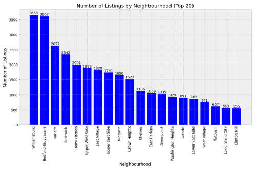

# Price Prediction for Airbnb Listings in New York

## Project Overview

This project aims to predict Airbnb listing prices in New York City using various regression models. The goal is to predict the price of a listing based on features such as property type, neighborhood, and availability. The project includes exploratory data analysis (EDA), feature engineering, model training, and performance evaluation.

### Insights:

- The Gradient Boosting model provides the best predictive accuracy, making it ideal for predicting Airbnb prices.
- The other models also provided valuable insights into feature relationships but were less accurate.

### Highlights:

- **Dataset**: Airbnb listings data for New York City, containing information about listing features, pricing, and location.
- **Models Evaluated**: Linear Regression, K-Nearest Neighbors (KNN), Random Forest, and Gradient Boosting.

## Tools & Technologies Used

- **Programming Language**: Python
- **Libraries**:
  - **Pandas**:
  - **Matplotlib & Seaborn**:
  - **Scikit-learn**:
  - **XGBoost**:
  - **Jupyter Notebooks**:
  - **Pipenv**: Dependency management (using `Pipfile` and `Pipfile.lock`)

## Dataset

Dataset from [OpenDataSoft](https://public.opendatasoft.com/explore/dataset/air-bnb-listings/information/?disjunctive.neighbourhood&disjunctive.column_10&disjunctive.city) which can be downloaded [here](https://data.insideairbnb.com/united-states/ny/new-york-city/2024-04-06/data/listings.csv.gz) contains Airbnb listing details for New York City, with information such as:

- **Listing Features**: Type of property, number of rooms, and amenities.
- **Location Information**: Neighborhood, latitude, longitude, and proximity to landmarks.
- **Price**: The target variable to be predicted (listing price).

## Steps


### Pre-processing Steps:

- Handling missing values
- Encoding categorical features
- Normalizing continuous variables

## Model Evaluation & Results

The following regression models were evaluated:

| **Model**               | **rMSE** | **R-squared** | **Evaluation**                                                                    |
| ----------------------- | -------- | ------------- | --------------------------------------------------------------------------------- |
| **Linear Regression**   | 61.074   | +0.078        | Higher rMSE, limited predictive accuracy.                                         |
| **K-Nearest Neighbors** | 37.358   | -0.043        | Lower rMSE than Linear Regression but poor model fit (negative R-squared).        |
| **Random Forest**       | 35.396   | +0.091        | Moderate performance, reasonable rMSE, positive R-squared.                        |
| **Gradient Boosting**   | 34.333   | +0.118        | Best performance with lowest rMSE and highest R-squared, indicating superior fit. |

## EDA - Visualizations

Top 20 neighborhoods in New York:



Room Types:


Price Distribution:


Price Distribution by Room:


Price Distribution by Neighbourhood:


## Regression - Visualizations

Linear Reg:


K-nearest and Support vector:


Random Forest and G-boost:


## Hyper-parameter Tuning

G-boost with hyper-parameters:


# How to run this project

- create pipenv virtual environment and install dependencies

  ```bash

  #create virtaul env
  pip install pipenv

  # activate
  pip env shell

  # install dependencies:
  pipenv install

  #run jupyter
  jupyter notebook
  ```
